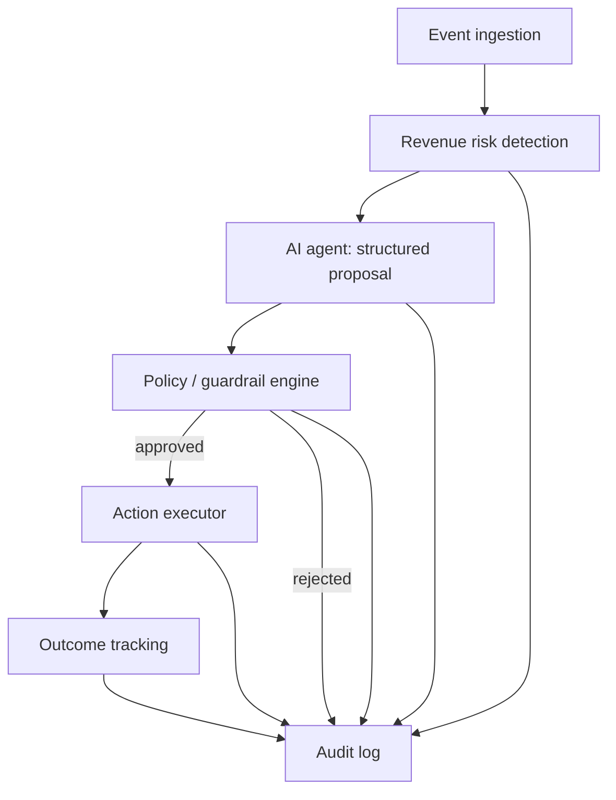
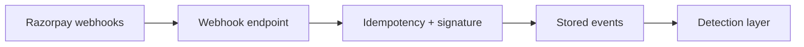
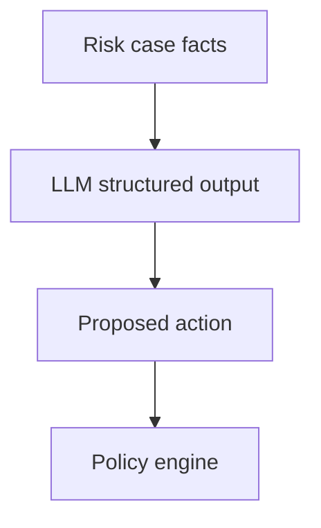
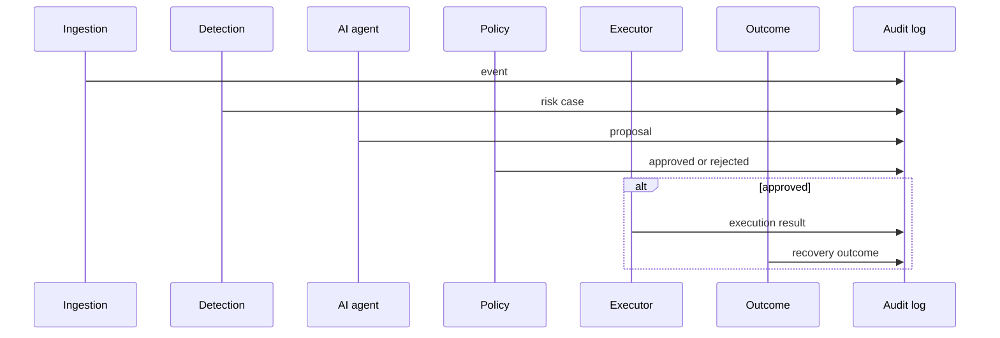

# RECAP Architecture

**RECAP** — Revenue Intelligence & Recovery Agent  
This document describes the intended system architecture. Application code, Docker, Razorpay wiring, and LLM integration are **not** implemented in this documentation phase.

---

## 1. High-level architecture

Core principle: **the AI never directly controls financial actions.**

```text
Event
  → Detection
  → AI reasoning
  → Proposed action
  → Deterministic policy engine
  → Approved / rejected
  → Action executor
  → Outcome
  → Audit log
```

- The **AI proposes**.
- The **policy engine decides**.
- The **executor acts**.



**Stack (when implementation begins):** Python 3.11+, FastAPI, Pydantic, SQLAlchemy, SQLite (PostgreSQL later if required), Next.js / React / Tailwind, Razorpay Test Mode, LLM structured outputs, Docker, GitHub.

---

## 2. Event ingestion layer

**Role:** Accept external events and persist them as immutable intake records before any reasoning.

**MVP sources:**

- Razorpay webhooks (payment failed and related payment events).
- Optional internal/manual case creation for demos (same schema as ingested events).

**Responsibilities:**

- Authenticate webhook signatures (Razorpay webhook secret).
- Idempotency: same event id must not create duplicate cases.
- Normalize to an internal event schema (source, type, payload ref, timestamps, payment identifiers, amount, currency).
- Enqueue or synchronously hand off to detection (MVP may be synchronous).

**Out of this layer:** AI calls, policy, Razorpay write APIs.



---

## 3. Revenue risk detection layer

**Role:** Decide whether an ingested event represents **revenue at risk** and open (or update) a **risk case**.

**Responsibilities:**

- Map event type to a leakage category (MVP: failed payments).
- Compute **amount at risk** from payment/order data.
- Deduplicate / attach to an existing open case when appropriate.
- Emit a case snapshot for the AI layer (facts only: ids, amounts, failure codes, timestamps).

**Does not:** Recommend actions, call the LLM, or execute recovery.

Future detectors (same interface, new rules): checkout abandonment, subscriptions, method problems, system degradation, B2B overdue, other recoverable leakage.

---

## 4. AI agent layer

**Role:** Reason over a risk case and emit a **structured proposed action**. Never execute.

**MVP:** LLM with structured outputs (Pydantic schemas). Tool calling is **later**.

**Inputs (facts):** case id, category, amount at risk, event facts, limited merchant context.

**Outputs (structured):**

- Likely cause / investigation summary
- Estimated recoverable amount
- Proposed action type + parameters
- Rationale (why this action)
- Confidence (informational only; **not** a policy override)

**Hard boundary:** This layer must not invoke Razorpay mutating APIs or the action executor. It may, in the future, use **read-only** tools; writes still go through policy → executor.



---

## 5. Policy / guardrail layer

**Role:** Deterministic approve / reject. Same inputs → same decision.

**Inputs:** proposed action, case facts, merchant policy config, engine version.

**Example rule families (illustrative, not a product redesign):**

- Action type allowlist
- Max amount for auto-execution vs require reject / human review
- Retry count and cooldown
- Forbidden actions (e.g. refunds, payouts) unless explicitly allowed
- Category-specific rules (MVP: failed payment only)

**Outputs:** `approved` | `rejected`, reason codes, policy version, rule hits.

**Hard boundary:** No LLM inside this layer. Rejection still writes to the audit log. Executor is not called on reject.

---

## 6. Action execution layer

**Role:** Perform only **policy-approved** actions.

**Responsibilities:**

- Verify approval token / record (case id, action id, policy version, expiry).
- Dispatch to adapters (notification, Razorpay retry where permitted, internal status).
- Catch and record execution failures without retrying via the LLM.
- Return structured result to outcome tracking and audit.

**Hard boundary:** No execution without a stored approval. No reinterpretation of the proposal.

---

## 7. Outcome tracking

**Role:** Close the loop: did the intervention recover revenue?

**Signals (MVP):**

- Subsequent Razorpay events for the same payment/order (captured / authorized / still failed).
- Executor result (notification sent, retry API accepted, etc.).

**Stored fields:** outcome status (`pending` | `recovered` | `not_recovered` | `unknown`), recovered amount, timestamps, linked case and action ids.

Outcome is **observed**, not claimed by the LLM. Recovery metrics in the product spec are computed from this layer.

---

## 8. Audit logging

**Role:** Append-only record of the full path for every case.

**Minimum stages logged:** event received, detection, AI proposal, policy decision, execution (if any), outcome updates.

**Properties:**

- Immutable inserts (no update-in-place of past decisions).
- Correlation ids: `event_id`, `case_id`, `proposal_id`, `policy_decision_id`, `execution_id`.
- Payload: enough to reconstruct answers in the product vision (what / why / recoverable / action / allowed / recovered).

Audit is written by each layer; it is not optional for “simple” paths.



---

## 9. Razorpay integration boundary

**Inside the boundary:**

- Test Mode keys and webhook secret (environment only; never in git).
- Webhook **receive** path → event ingestion.
- **Read** APIs if needed to hydrate a case (payment/order fetch).
- **Write** APIs **only** from the action executor, and only for policy-approved action types.

**Outside the boundary:**

- AI agent, policy engine, and frontend must not hold Razorpay write credentials in application logic that skips the executor.
- Live/production mode is out of MVP.

No Razorpay connection is created in this documentation-only phase.

---

## 10. Database boundary

**MVP:** SQLite via SQLAlchemy.

**Logical stores (tables to be designed at implementation time):**

- Events (raw/normalized intake)
- Risk cases
- AI proposals
- Policy decisions
- Executions
- Outcomes
- Audit entries (or audit as the canonical event log plus projections)

**Boundary rules:**

- Application access through repositories / SQLAlchemy models, not ad-hoc SQL from the frontend.
- PostgreSQL is a later swap if required (same schemas, different engine URL).
- Secrets are not stored in the database in plaintext if avoidable; webhook secrets stay in env.

---

## 11. Frontend boundary

**Stack:** Next.js / React, Tailwind CSS.

**Operator surfaces (MVP intent):**

- List of revenue-at-risk cases
- Case detail: facts, AI proposal, policy decision, execution, outcome
- Audit timeline for a case

**Boundary:**

- Frontend talks to **FastAPI** only (REST or similar).
- No direct SQLite access, no Razorpay keys, no LLM API keys in the browser.
- Frontend may display rejected proposals; it must not trigger executor without a backend policy check.

---

## 12. Future scaling considerations

| Area | Later change |
|------|----------------|
| Database | SQLite → PostgreSQL if concurrency or size requires it |
| Ingestion | Async queue if webhook volume grows |
| Detection | Additional detectors per leakage category, same case model |
| AI | Tool calling for investigation; still no direct financial control |
| Policy | Merchant-configurable rule packs, versioned |
| Executor | More adapters; still approval-gated |
| Multi-tenant | Merchant isolation if more than one Buildathon merchant |
| Infra | Docker as defined for the project; horizontal API workers if needed |

Scaling must preserve the pipeline: **Event → Detection → AI → Proposal → Policy → Executor → Outcome → Audit.**
---
